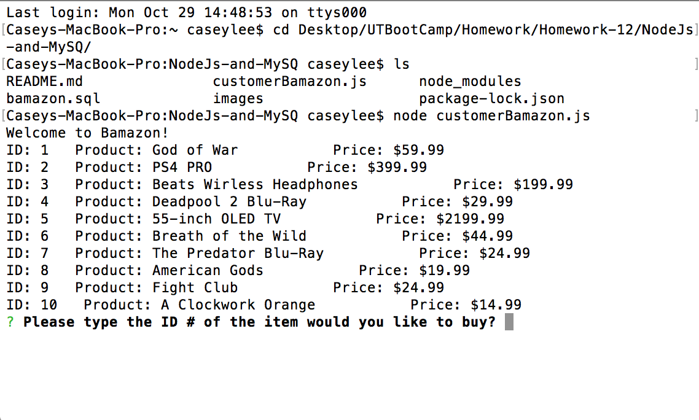

# NodeJs-and-MySQ

# Bamazon

* Welcome screenshot

* Buy an item

* You can keep shopping after you bought the first time 

* If you make a wrong choice you will not be able to buy

* Connection well end on it's own

